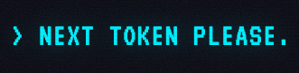

<p align="center">
  
</p>

<p align="center">
  <em>You are the language model now. Predict what comes next.</em>
</p>

<p align="center">
  
  
  
  
</p>

---

A browser game where you role-play as a language model, completing an AI's answer one word at a time.

Two workspaces:

- [`frontend/`](frontend/README.md) — TypeScript + Vite, vanilla DOM
- [`backend/`](backend/README.md) — Python 3.11 + FastAPI + Ollama

See [`AGENTS.md`](AGENTS.md) for working conventions and commands.

## Quick start

Run the full stack (frontend + backend + Ollama) from the repo root:

```bash
docker compose up --build
```

---

<p align="center">
  &copy; Abacato Games &middot; <a href="mailto:contact@abacatogames.com">contact@abacatogames.com</a>
</p>
